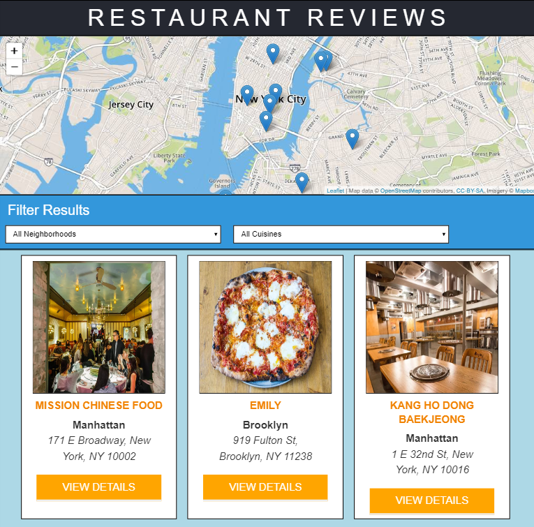

# Restaurant Reviews App

## Table of Contents

* [Instructions](#instructions)
* [Other Contributors](#other-contributors)
* [Contributing](#contributing)
* [Licenses](#licenses)

## Instructions

This project is a simple single-page application that allows users to select a residential area in New York City and view a list of nearby restaurants. For each restaurant in the application, the application includes a map highlighting the restaurant's location (powered by Mapbox), a set of recent user reviews, and an assortment of details about food selection/hours (for the purpose of this project, the latter two elements are retrieved from a JSON file within this repository).

To run this application on your browser, you'll need to download the following files (all included within this repository!):
1. index.html, restaurants.html
2. service_worker.js, sw_registration.js (includes a service worker for caching / offline usability)
3. css
   * styles.css
   * responsive-index.css, responsive-rest.css (include responsive design features)
3. js
   * main.js
   * dbhelper.js
   * restaurant_info.js
4. img 
   * All included .jpg and .png files (needed to load the restaurant images). 
5. data
   * restaurants.json (needed to pull restaurant list and detail)

Once all the above files have been loaded onto your computer, start up a simple HTTP server to serve up the site files on your local computer. If you don't know how to do this, see the next paragraph. If you do, you can skip to two paragraphs down. 

Python has some simple tools to start up a server, and you don't even need to know Python. In a terminal, check the version of Python you have: `python -V`. If you have Python 2.x, spin up the server with `python -m SimpleHTTPServer 8000` (or some other port, if port 8000 is already in use.) For Python 3.x, you can use `python3 -m http.server 8000` (on certain Windows computers, the command may instead be `python -m http.server 8000`. If you don't have Python installed, navigate to Python's [website](https://www.python.org/) to download and install the software.

Also note that the browser must support ES6 (due to usage of the 'class' keyword). If your browser does not support the ES6 features in this game, you can use a JS transpiler such as Babel (https://babeljs.io/) to transpile the code to ES5.

This repository also uses [leafletjs](https://leafletjs.com/) with [Mapbox](https://www.mapbox.com/). I am currently using my own Mapbox key to power the project, but if you choose to clone or download this repo you should replace my Mapbox key with your own. Mapbox is free to use, and does not require any payment information. 

## Other Contributors

Starter HTML / CSS / JS code, game engine, and default artwork (including images, styling, and symbols) taken from the [Udacity classroom repository](https://github.com/udacity/mws-restaurant-stage-1).

[CODEOWNERS](CODEOWNERS) also includes a list of individual contributors to the original project.

## Contributing

Since this project is being used as an evaluation for the Udacity FEND, at this time I am **NOT** accepting pull requests. This may change as the project and nanodegree course are completed and I look to optimize the project further, so stay tuned!

For details, check out [CONTRIBUTING.md](CONTRIBUTING.md).

## Licenses

This project is freely available for you to use however you want. If you are a fellow Udacity FEND student, feel free to look at this project for guidance but please do not utilize any of my code in a way that violates Udacity's Honor Code / plagiarism guidelines.